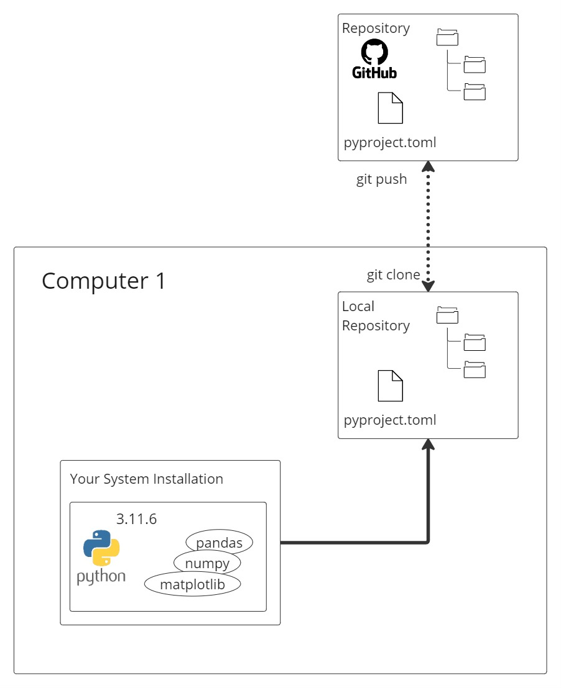
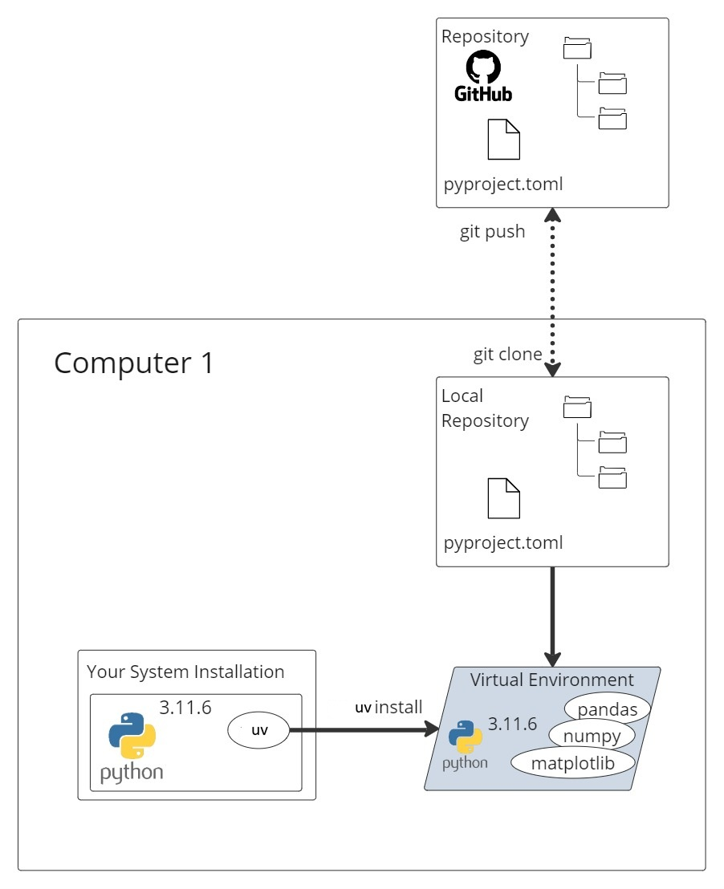
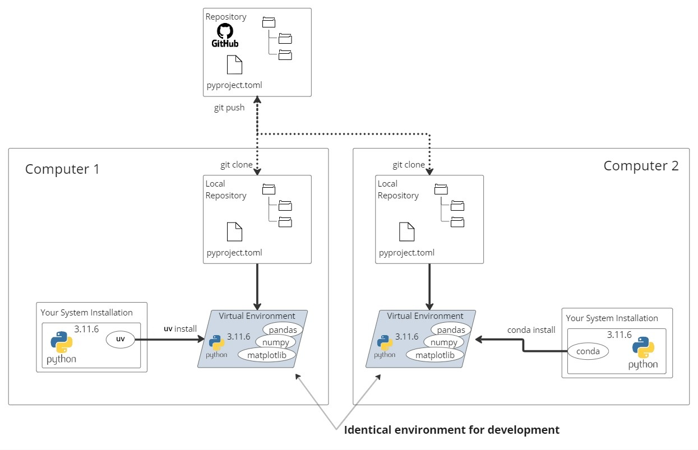
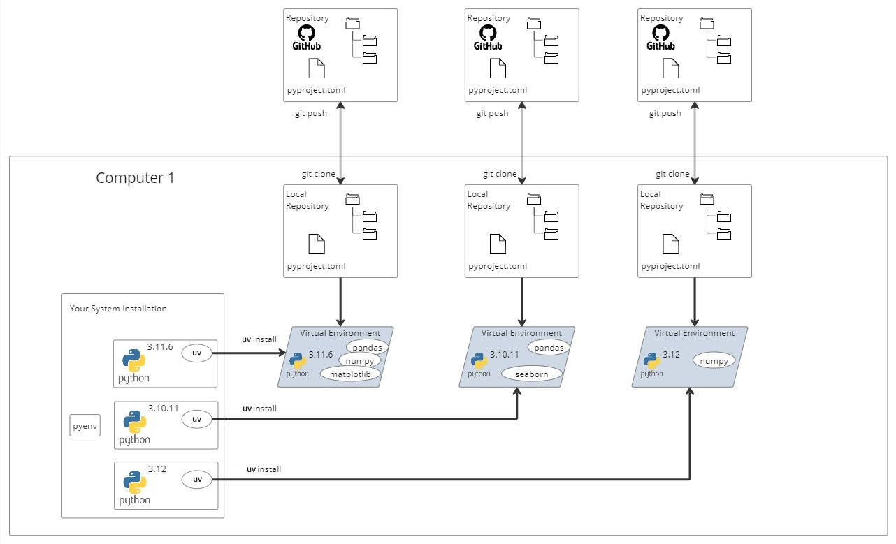

# 01 - Virtual Environments and Packages

Using Python to explore and process data is largely about learning how to use relevant open-source packages such as `pandas`, `numpy`, or `matplotlib`.

These packages have been created and maintained by the open-source community over many years. When a Python project imports and uses one of these packages, that package becomes a **dependency** of the project.

In this document, we will describe a best-practice approach for managing Python dependencies that is:

- convenient;
- reliable;
- isolated between projects;
- reproducible for other developers.

We will achieve this by using:

- a Python virtual environment;
- the dependency and project manager `uv`;
- a `pyproject.toml` file;
- a dependency lockfile.

If you are already familiar with virtual environments and tools such as `uv`, PDM, Poetry, or Conda, you may skip this document.

---

## 1. The problem with installing Python packages globally

In Python tutorials and introductory courses, you will often see packages installed directly with `pip`:

```powershell
pip install pandas
pip install numpy
```

The commands themselves are not necessarily wrong. The problem is **where the packages are installed**.

If these commands install packages into a shared or global Python installation, every project on your computer will use the same collection of packages.

For example, your system Python installation could contain:

```text
Python 3.11
├── pandas
├── numpy
└── matplotlib
```

This may work when you only have one project, but it quickly becomes difficult to manage when you work on several projects.

Different projects may require:

- different packages;
- different versions of the same package;
- different Python versions.

For example:

```text
Project A requires pandas 2.1
Project B requires pandas 2.3
```

Updating `pandas` for Project B could break Project A.

It also becomes difficult to answer an important question:

> Which exact packages and versions are required to reproduce this project?

For this reason, installing project dependencies into a shared global Python environment is not recommended.

_Not recommended: all projects use packages from the same shared Python installation._



---

## 2. Python virtual environments

A Python virtual environment is an isolated Python environment created for one project.

It contains:

- a Python interpreter;
- the packages installed for that project;
- the command-line tools required by that project.

A typical project might contain a virtual environment called `.venv`:

```text
sales-analysis/
├── .venv/
├── pyproject.toml
├── uv.lock
├── README.md
└── src/
```

The packages installed inside `.venv` are only available to that project.

Another project can have its own `.venv` containing different packages or different package versions.

This means that projects remain isolated from each other.

```text
Project A
└── .venv
    ├── pandas 2.1
    └── numpy 1.x

Project B
└── .venv
    ├── pandas 2.3
    └── numpy 2.x
```

The environment of Project A does not affect Project B, and the environment of Project B does not affect Project A.

---

## 3. What `uv` does

`uv` is a Python project and dependency manager.

It is installed once on your computer as a standalone command-line tool.

On Windows, for example, it can be installed with:

```powershell
winget install --id astral-sh.uv --exact
```

`uv` can then be used to:

- create Python projects;
- create virtual environments;
- install and remove dependencies;
- resolve compatible dependency versions;
- generate a lockfile;
- synchronize an environment;
- run commands inside the project environment.

The main idea is:

> `uv` manages the environment for the project instead of installing project packages into the shared system Python installation.

_Recommended: use one virtual environment for each project._



In this diagram:

1. The repository contains the project files.
2. The project declares its dependencies in `pyproject.toml`.
3. `uv` reads the project configuration.
4. `uv` creates a local virtual environment.
5. The project dependencies are installed inside that environment.

The virtual environment is normally stored in:

```text
.venv/
```

This directory stays on your computer and is not uploaded to GitHub.

---

## 4. The repository and the local environment

Python projects are often stored in Git repositories hosted on services such as GitHub.

The GitHub repository contains the files required to understand, modify, and reproduce the project.

A typical repository may contain:

```text
sales-analysis/
├── .python-version
├── .gitignore
├── pyproject.toml
├── uv.lock
├── README.md
├── notebooks/
├── src/
└── tests/
```

It does not normally contain:

```text
.venv/
```

The virtual environment is local and machine-specific. It can be recreated from the project files.

A developer downloads a local copy of the repository using Git:

```powershell
git clone <repository-url>
```

The developer then enters the project folder:

```powershell
cd sales-analysis
```

Finally, the developer recreates the project environment:

```powershell
uv sync
```

`uv sync` reads the project configuration and lockfile, creates `.venv` when necessary, and installs the required dependencies.

---

## 5. The role of `pyproject.toml`

A modern Python project will often contain a file called:

```text
pyproject.toml
```

This file describes the project.

It can contain:

- the project name;
- the project version;
- the supported Python versions;
- the main dependencies;
- development dependencies;
- tool configuration.

A simple example is shown below:

```toml
[project]
name = "python-onboarding"
version = "0.1.0"
description = "Training material for Python onboarding"
authors = [
    { name = "Arnaud Vigneron", email = "arnaud.vigneron@example.com" },
]
requires-python = ">=3.12,<3.14"

dependencies = [
    "numpy",
    "pandas",
    "matplotlib",
]

[dependency-groups]
dev = [
    "pytest",
    "ruff",
]
```

---

## 6. Project metadata

The project name and version are declared under the `[project]` section:

```toml
[project]
name = "python-onboarding"
version = "0.1.0"
```

The project name identifies the package or application.

The version identifies the current version of the project.

---

## 7. Supported Python versions

The supported Python versions are declared with `requires-python`:

```toml
[project]
requires-python = ">=3.12,<3.14"
```

This means:

```text
Python 3.12 is supported
Python 3.13 is supported
Python 3.14 is not supported
Python 3.11 is not supported
```

This information helps tools such as `uv` determine whether the selected Python version is compatible with the project.

A project may also contain a `.python-version` file:

```text
3.13.7
```

This file tells tools such as `pyenv` which specific Python version should be used when working in the project.

---

## 8. Main dependencies

The packages required to run the project are declared under `dependencies`:

```toml
[project]
dependencies = [
    "numpy",
    "pandas",
    "matplotlib",
]
```

These are the direct dependencies of the project.

For example, if the project contains:

```python
import pandas as pd
import numpy as np
import matplotlib.pyplot as plt
```

then the project depends on:

- `pandas`;
- `numpy`;
- `matplotlib`.

Dependencies can be added using `uv`:

```powershell
uv add pandas
uv add numpy
uv add matplotlib
```

They can also be added together:

```powershell
uv add pandas numpy matplotlib
```

`uv` updates the project configuration automatically.

---

## 9. Development dependencies

Some packages are not required to run the final analysis or application, but they are useful while developing it.

Examples include:

- `pytest` for tests;
- `ruff` for formatting and code quality;
- documentation tools;
- type-checking tools.

These can be declared in a dependency group:

```toml
[dependency-groups]
dev = [
    "pytest",
    "ruff",
]
```

They can be added using:

```powershell
uv add --dev pytest ruff
```

Development dependencies are useful for contributors, but they are not necessarily required by users of the project.

---

## 10. The role of `uv.lock`

The `pyproject.toml` file declares the direct dependencies of the project.

However, each dependency may itself depend on other packages.

For example:

```text
Your project
└── pandas
    ├── numpy
    ├── python-dateutil
    └── pytz
```

These additional packages are called **indirect** or **transitive dependencies**.

The complete dependency graph is recorded in:

```text
uv.lock
```

The lockfile contains the resolved package versions needed to recreate a consistent project environment.

The distinction is:

```text
pyproject.toml
    Describes what the project requires.

uv.lock
    Records the complete resolved dependency environment.
```

Both files should normally be committed to Git:

```text
pyproject.toml
uv.lock
```

The local virtual environment should not be committed:

```text
.venv/
```

---

## 11. Creating a new environment

When creating a new project, you can start with:

```powershell
mkdir sales-analysis
cd sales-analysis
```

Initialize Git:

```powershell
git init
```

Select the local Python version:

```powershell
pyenv local 3.13.7
```

Initialize the Python project:

```powershell
uv init
```

Add dependencies:

```powershell
uv add pandas numpy matplotlib
```

Add development tools:

```powershell
uv add --dev pytest ruff
```

`uv` will create or synchronize the project virtual environment as needed.

The resulting project may look like this:

```text
sales-analysis/
├── .git/
├── .venv/
├── .python-version
├── pyproject.toml
├── uv.lock
├── README.md
└── main.py
```

---

## 12. Reproducing an existing project

Imagine that a developer creates a project and pushes it to GitHub.

The repository contains:

```text
Repository
├── .python-version
├── pyproject.toml
├── uv.lock
└── project source files
```

Another developer can clone the project:

```powershell
git clone <repository-url>
cd <repository-folder>
```

Install the required Python version when necessary:

```powershell
pyenv install
```

Then recreate the environment:

```powershell
uv sync
```

The new developer now has a local virtual environment containing the dependencies defined by the project.

_Team members can recreate consistent project environments from the same repository._



The virtual environment itself is not transferred through GitHub.

Instead, GitHub stores the instructions required to recreate it:

```text
.python-version
pyproject.toml
uv.lock
```

This keeps repositories smaller and avoids committing machine-specific files.

---

## 13. Consistent rather than physically identical environments

When two developers run:

```powershell
uv sync
```

they recreate consistent dependency environments based on the same project definition and lockfile.

The environments may not be physically identical in every situation.

For example:

- one developer may use Windows;
- another may use Linux;
- one computer may use an Intel processor;
- another may use an ARM processor.

Some Python packages provide different builds for different operating systems or processors.

For this reason, it is more accurate to say:

> The development environments are reproducible and consistent.

rather than:

> The environments are always completely identical.

---

## 14. Using different project-management tools

The Python ecosystem contains several tools for managing environments and dependencies, including:

- `uv`;
- PDM;
- Poetry;
- Conda;
- `venv` and `pip`.

Many of these tools support the `pyproject.toml` standard.

However, they do not necessarily use the same lockfile format or resolve dependencies in exactly the same way.

For a team project, it is therefore recommended that all contributors use the project-management tool documented by the repository.

For the projects in this guide, the standard tool is:

```text
uv
```

This means that contributors should normally recreate the project environment with:

```powershell
uv sync
```

---

## 15. Working with multiple projects

Virtual environments allow you to work on several Python projects in parallel.

Each project has:

- its own repository;
- its own `pyproject.toml`;
- its own `uv.lock`;
- its own `.venv`;
- optionally, its own Python version.

For example:

```text
Project A
├── Python 3.11
├── pandas
├── numpy
└── matplotlib

Project B
├── Python 3.10
├── pandas
└── seaborn

Project C
├── Python 3.12
└── numpy
```

_Each project is isolated in its own virtual environment._



The dependencies installed for one project do not affect the dependencies installed for another project.

This is particularly useful when:

- maintaining older projects;
- testing a project on multiple Python versions;
- working with different teams;
- comparing package versions;
- moving between data-analysis and application-development projects.

---

## 16. Using `pyenv` and `uv` together

`pyenv` and `uv` solve related but different problems.

```text
pyenv
    Manages Python interpreter versions.

uv
    Manages project environments and dependencies.
```

For example:

```powershell
pyenv install 3.13.7
pyenv local 3.13.7
```

This selects Python 3.13.7 for the current project.

You can then initialize or synchronize the project with `uv`:

```powershell
uv init
uv add pandas numpy matplotlib
```

For an existing project:

```powershell
pyenv install
uv sync
```

A useful mental model is:

```text
pyenv selects the Python version
            ↓
uv creates the project environment
            ↓
uv installs and locks the project dependencies
```

---

## 17. Running commands inside the environment

You can activate the virtual environment manually:

```powershell
.venv\Scripts\Activate.ps1
```

After activation, commands such as the following use the project environment:

```powershell
python --version
python main.py
```

You can also run commands through `uv` without activating the environment manually:

```powershell
uv run python main.py
```

Run tests:

```powershell
uv run pytest
```

Format the project:

```powershell
uv run ruff format .
```

Check the code:

```powershell
uv run ruff check .
```

Using `uv run` ensures that the command runs inside the correct project environment.

---

## 18. Files that should and should not be committed

The following files should normally be committed to Git:

```text
.python-version
pyproject.toml
uv.lock
README.md
src/
tests/
notebooks/
```

The following files should normally not be committed:

```text
.venv/
__pycache__/
.env
.ipynb_checkpoints/
```

A `.gitignore` file can be used to prevent Git from tracking these local files:

```gitignore
# Virtual environment
.venv/

# Python cache
__pycache__/
*.py[cod]

# Environment variables and secrets
.env
.env.*

# Jupyter
.ipynb_checkpoints/
```

---

## 19. Summary

Installing every package into one shared Python environment makes projects difficult to maintain and reproduce.

A better workflow is:

1. Use `pyenv` to select the required Python version.
2. Use one virtual environment per project.
3. Declare project dependencies in `pyproject.toml`.
4. Record resolved dependencies in `uv.lock`.
5. Use `uv sync` to recreate the project environment.
6. Commit the project definition and lockfile to Git.
7. Do not commit the `.venv` directory.

The complete workflow looks like this:

```text
GitHub repository
├── source code
├── .python-version
├── pyproject.toml
└── uv.lock
          ↓
       git clone
          ↓
      local project
          ↓
       uv sync
          ↓
        .venv
├── Python interpreter
└── project dependencies
```

This approach provides:

- isolated projects;
- cleaner system installations;
- fewer dependency conflicts;
- easier collaboration;
- reproducible environments;
- a consistent workflow across teams.
