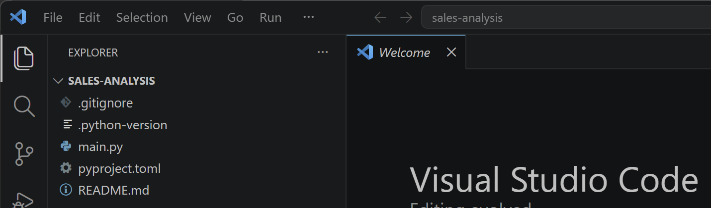
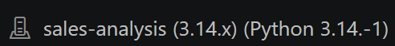
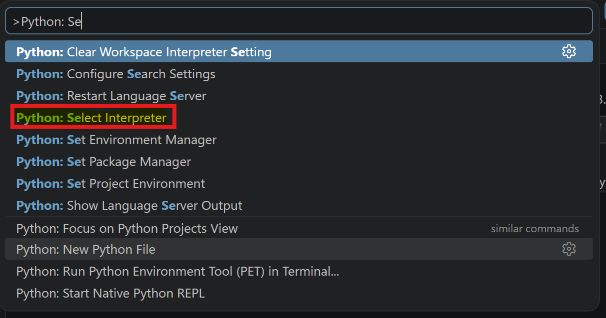
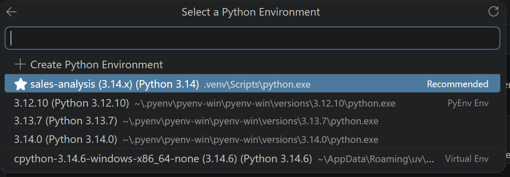

# 02 - Setting up Visual Studio Code

## Goal

In this chapter, we'll prepare Visual Studio Code for Python development and configure it to work with the workflow introduced in the previous chapter.

We'll also establish a few habits that we'll use throughout the rest of this guide, such as opening projects from a PowerShell terminal and working with the project's virtual environment.

## Prerequisites

Before starting this chapter, you should have completed:

- 00 - Initial Setup
- 01 - Virtual Environments and Packages

or already have:

- Visual Studio Code installed
- The recommended extensions installed
- A Python project created with `uv`

## Learning objectives

After completing this chapter, you'll be able to:

- open a project correctly in Visual Studio Code
- understand how VS Code detects the project environment
- select the correct Python interpreter
- configure Visual Studio Code for the workflow used throughout this guide
- verify that everything is working before writing code

---

## Why this matters

Visual Studio Code is where we'll write, run, and debug our Python code.

Rather than opening individual Python files, we'll always open the project itself.

Opening the project allows Visual Studio Code to automatically detect the project's Git repository, virtual environment, Python interpreter, and configuration files.

Once the project is open, all of the tools introduced in the previous chapters work together automatically.

---

## Opening a project

Throughout this guide, we'll open our projects from a PowerShell terminal.

First, navigate to the project folder.

```powershell
cd .\Python_Projects\sales-analysis\
```

Then open the project with:

```powershell
code .
```

The `.` represents the current directory.

Rather than opening a single file, `code .` tells Visual Studio Code to open the entire project.

This allows VS Code to automatically detect:

- the Git repository
- the virtual environment
- the Python interpreter
- the project configuration files

Throughout the rest of this guide, we'll assume projects are opened using `code .`.

The following screenshot shows the typical workflow.


Once the project opens, the Explorer displays the complete project structure, including the virtual environment and the configuration files introduced in the previous chapter.



We'll use this view throughout the rest of the guide.

---

## Selecting the Python interpreter

Every time a Python project is opened, Visual Studio Code needs to know which Python installation it should use.

Throughout this guide, that will almost always be the Python interpreter inside the project's virtual environment.

If the correct interpreter isn't selected, you may notice:

- Import errors even though the required packages are installed
- The wrong version of Python being used
- Code that runs in the terminal but not in Visual Studio Code

Fortunately, Visual Studio Code usually detects the project's virtual environment automatically.

You can verify the selected interpreter by looking at the bottom-right corner of the window.

The following screenshot shows a project using the correct interpreter.



If the interpreter displayed in the status bar corresponds to your project's virtual environment, no further action is required.

If a different interpreter is selected, or if no interpreter is shown, you can select it manually.

Open the Command Palette using:

```text
Ctrl + Shift + P
```

Then search for:

```text
Python: Select Interpreter
```

The following screenshot shows where to find the command.



Selecting this command opens the list of available Python interpreters.

Choose the interpreter located inside the project's `.venv` folder. In most cases, Visual Studio Code marks it as **Recommended**.

The following screenshot shows an example.



Once selected, Visual Studio Code remembers this choice for the project, so you won't need to repeat this step every time you open it.

---

## Recommended extensions

Throughout this guide, we'll use a small number of extensions that make Python development easier.

### Essential

- Python
- Pylance
- Ruff
- GitLens

These extensions provide Python support, code analysis, formatting, linting, and Git integration.

### Recommended

- Jupyter
- Error Lens
- Even Better TOML
- Markdown All in One
- GitHub Pull Requests and Issues

These extensions improve the development experience but are not required to follow the guide.

If you already use different extensions that provide similar functionality, feel free to continue using them. The extensions listed above are simply the ones used throughout this guide.

---

## Configuring Visual Studio Code

Visual Studio Code offers hundreds of configuration options.

Rather than configuring each project individually, we'll configure our user settings once and use the same setup throughout this guide.

Open the Command Palette:

```text
Ctrl + Shift + P
```

Search for:

```text
Preferences: Open User Settings (JSON)
```

In the next section, we'll review the different settings before combining them into a single `settings.json` file.

---

## Configuring Visual Studio Code

Visual Studio Code stores its configuration in a file called `settings.json`.

Rather than changing settings as we discover new features, we'll configure Visual Studio Code once and use the same configuration throughout this guide.

We'll review the configuration by section before combining everything into a single file.

---

### Editor settings

```json
"editor.formatOnSave": true,
"editor.tabSize": 4,
"editor.rulers": [88],
"files.trimTrailingWhitespace": true,
"files.insertFinalNewline": true,
```

These settings improve the editing experience and help keep files consistent across projects.

In particular, formatting code automatically when saving helps us maintain a consistent coding style without thinking about it.

---

### Python settings

```json
"python.defaultInterpreterPath": "${workspaceFolder}\\.venv\\Scripts\\python.exe",
"python.terminal.activateEnvironment": true,
"python.analysis.typeCheckingMode": "basic",
```

These settings configure how Visual Studio Code interacts with Python projects.

The default interpreter points to the project's virtual environment, while automatically activating the environment ensures that the integrated terminal always uses the correct Python installation.

---

### Ruff settings

```json
"[python]": {
    "editor.defaultFormatter": "charliermarsh.ruff"
},

"editor.codeActionsOnSave": {
    "source.fixAll.ruff": "explicit",
    "source.organizeImports.ruff": "explicit"
},
```

Throughout this guide, we'll use Ruff as our formatter and linter to format our code, organize imports, and report common issues. Using a single tool keeps the configuration simple and avoids having to maintain multiple tools that perform similar tasks.

---

### Git settings

```json
"git.autofetch": true,
"git.confirmSync": false,
```

These settings improve the Git integration built into Visual Studio Code.

Automatic fetching keeps your local repository up to date with changes from the remote repository without requiring manual refreshes.

---

### Terminal settings

```json
"terminal.integrated.defaultProfile.windows": "PowerShell"
```

Throughout this guide, we'll use PowerShell as our integrated terminal.

This keeps the commands consistent with the examples shown in each chapter.

---

## Complete configuration

The complete `settings.json` used throughout this guide is shown below.

```json
{
    "editor.formatOnSave": true,
    "editor.tabSize": 4,
    "editor.rulers": [88],
    "files.trimTrailingWhitespace": true,
    "files.insertFinalNewline": true,

    "python.defaultInterpreterPath": "${workspaceFolder}\\.venv\\Scripts\\python.exe",
    "python.terminal.activateEnvironment": true,
    "python.analysis.typeCheckingMode": "basic",

    "[python]": {
        "editor.defaultFormatter": "charliermarsh.ruff"
    },

    "editor.codeActionsOnSave": {
        "source.fixAll.ruff": "explicit",
        "source.organizeImports.ruff": "explicit"
    },

    "git.autofetch": true,
    "git.confirmSync": false,

    "terminal.integrated.defaultProfile.windows": "PowerShell"
}

---

## Verifying your setup

Before moving on, verify that:

- The project opens successfully using `code .`
- The Explorer displays the complete project structure
- The correct Python interpreter is selected
- The integrated terminal opens in the project folder
- Python files are formatted automatically when saved

If one of these steps doesn't work as expected, it's worth taking a few minutes to fix it now. A correctly configured development environment will make the rest of the guide much smoother.

---

## Summary

In this chapter, we've prepared Visual Studio Code for the workflow we'll use throughout the rest of this guide.

Rather than opening individual files, we'll always open the project using `code .` from a PowerShell terminal. This allows Visual Studio Code to automatically detect the project's virtual environment, Git repository, and configuration files.

We've also configured Visual Studio Code to:

- use the project's virtual environment
- format Python code automatically
- use Ruff for formatting and linting
- integrate with Git
- use PowerShell as the default terminal

These settings provide a consistent development environment across all of our Python projects.

> [!NOTE]
> This configuration reflects the workflow used throughout this guide. As you become more familiar with Visual Studio Code, you may decide to customize these settings to better match your own preferences.

---

## After completing this chapter

You should now be able to:

- open a Python project correctly using `code .`
- understand how Visual Studio Code detects the project environment
- verify that the correct Python interpreter is selected
- configure Visual Studio Code for the workflow used throughout this guide
- confirm that your development environment is ready before creating or modifying Python projects
