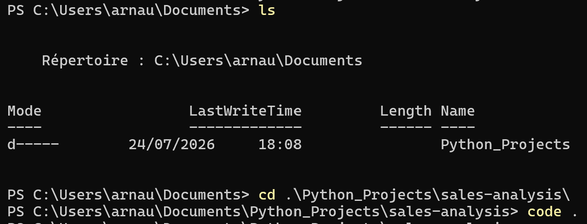
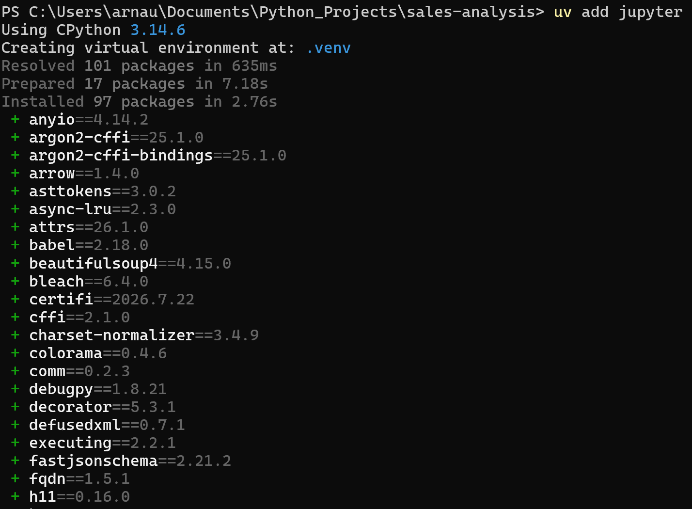
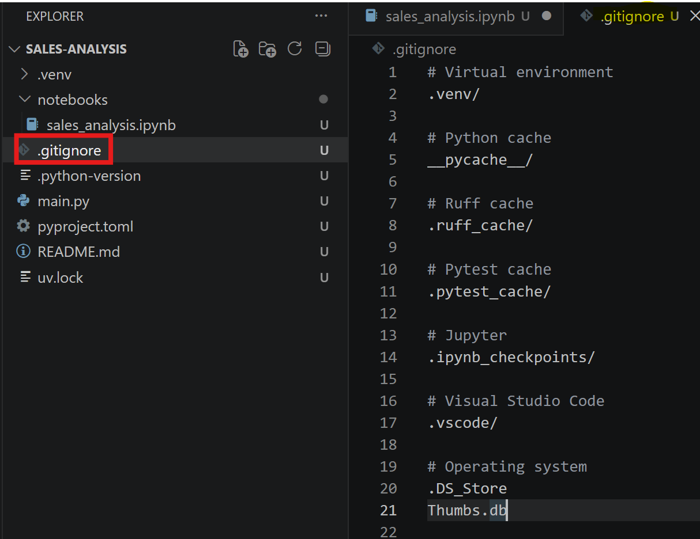

# 03 - Creating Your First Project

## Goal

In this chapter, we'll create our first Python project using the workflow introduced in the previous chapters.

We'll create a new project with `uv`, prepare it for version control, organize it for data analysis, and verify that everything is ready before writing our first lines of code.

## Prerequisites

Before starting this chapter, you should already have:

- Git installed
- `pyenv` configured
- Python installed
- `uv` installed
- Visual Studio Code configured

If not, Chapters 00 to 02 cover this setup.

## Learning objectives

After completing this chapter, you'll be able to:

- create a new Python project with `uv`
- organize a project for data analysis
- understand the files generated by `uv`
- create a `.gitignore`
- prepare a project for version control

---

## Why this matters

A project is easier to maintain when it starts with a clean structure.

Whether you're working independently or as part of a team, organizing projects consistently makes them easier to understand, easier to maintain, and easier to collaborate on.

Throughout this guide, we'll use the same workflow whenever we create a new project.

The example project used throughout this repository is named `sales-analysis`. The project itself isn't important; it simply provides a consistent example while we focus on the workflow.

---

## Creating a workspace

As the number of projects grows, it becomes useful to keep them in a dedicated location.

Throughout this guide, we'll store our Python projects inside a folder named `Python_Projects`.

For example:

```text
C:\
└── Python_Projects
    ├── sales-analysis
    ├── customer-segmentation
    ├── forecasting
    └── dashboard-automation
```

This isn't a requirement, but it keeps projects organized and easy to find.

If you haven't already created this folder, you can do so with:

```powershell
mkdir C:\Python_Projects
```

Navigate to the workspace:

```powershell
cd C:\Python_Projects
```

From here, we're ready to create our first project.

---

## Creating a new project

Throughout this guide, we'll use a project named `sales-analysis`.

The goal isn't to build a complete application, but to use a consistent example while learning the workflow.

From your `Python_Projects` folder, create the project with:

```powershell
uv init sales-analysis
```

This command creates a new folder named `sales-analysis` and generates the files required to start a modern Python project.

Navigate to the project:

```powershell
cd .\sales-analysis\
```

Open the project in Visual Studio Code:

```powershell
code .
```

The following screenshot shows the complete workflow.


Once the project opens, you should see a structure similar to the following.



At this point, the project has been created successfully.

Before we continue, let's take a moment to understand the files that `uv` generated for us.

---

## Understanding the project structure

A newly created project contains a small number of files.

Each of them has a specific role within the project.

```text
sales-analysis/
├── .python-version
├── .git/
├── .gitignore
├── .python-version
├── .venv/
├── main.py
├── pyproject.toml
├── README.md
└── uv.lock
```

Let's briefly look at the purpose of each file.

| File | Purpose |
|------|---------|
| `.git/` | Stores the Git repository and project history |
| `.gitignore` | Defines which files and folders Git should ignore |
| `.python-version` | Records the Python version used by the project |
| `.venv/` | Contains the project's virtual environment |
| `main.py` | A simple Python entry point created by `uv` |
| `pyproject.toml` | Describes the project and its dependencies |
| `README.md` | Documents the project |
| `uv.lock` | Records the exact versions of installed packages |

At this stage, there's no need to understand every file in detail.

Throughout the rest of this guide, we'll come back to each of them as they become relevant.

---

## Preparing the project

`uv` creates a clean starting point for any Python project.

Before we begin working, we'll make a few small changes that better support a typical data analysis workflow.

### Creating a `notebooks` folder

Many data analysis projects begin with exploration.

Rather than writing Python scripts immediately, it's common to explore datasets, test ideas, and create visualizations using Jupyter notebooks.

Throughout this guide, we'll keep notebooks inside a dedicated `notebooks` folder.

Create it with:

```powershell
mkdir notebooks
```

Your project should now look similar to this:

```text
sales-analysis/
├── .git/
├── .gitignore
├── .python-version
├── .venv/
├── notebooks/
├── main.py
├── pyproject.toml
├── README.md
└── uv.lock
```

This provides a simple starting point for most data analysis projects. As projects grow, you may decide to add additional folders, but we'll keep the structure intentionally simple for now.

---

## Installing Jupyter

Many data analysis projects rely on Jupyter notebooks during the exploration phase.

We'll use Jupyter throughout this guide, so let's install it now.

```powershell
uv add jupyter
```

The command installs Jupyter inside the project's virtual environment and updates the project configuration.



Don't worry about the list of installed packages. Jupyter depends on many other Python packages, and `uv` installs everything automatically.

We'll come back to package management in the next chapter, where we'll learn how `uv` adds, updates, and removes project dependencies.

---

## Creating a `.gitignore`

A Git repository should only contain files that are needed to understand, run, and maintain the project.

Files that can be recreated automatically, such as virtual environments or temporary cache files, should not be committed.

Create a file named `.gitignore` in the project root and add the following content.

```gitignore
# Virtual environment
.venv/

# Python cache
__pycache__/

# Ruff
.ruff_cache/

# Pytest
.pytest_cache/

# Jupyter
.ipynb_checkpoints/

# Visual Studio Code
.vscode/

# Operating system
.DS_Store
Thumbs.db
```

We'll revisit this file later when we look at Git in more detail.

---

## Creating a `.gitignore`

Now that the project has been created, let's tell Git which files should be tracked and which files should remain local to your computer.

The purpose of a `.gitignore` file is to exclude files that can be recreated automatically or that are specific to your development environment.

For example:

- the project's virtual environment
- temporary cache files
- editor-specific settings
- operating system files

These files are useful while developing, but they shouldn't become part of the project's history.

Create a file named `.gitignore` in the root of the project and add the following content.



```gitignore
# Virtual environment
.venv/

# Python cache
__pycache__/

# Ruff cache
.ruff_cache/

# Pytest cache
.pytest_cache/

# Jupyter
.ipynb_checkpoints/

# Visual Studio Code
.vscode/

# Operating system
.DS_Store
Thumbs.db
```

At first glance, this file may seem like a list of folders to ignore.

In practice, it's a way of keeping the repository focused on the files that define the project rather than the files generated while working on it.

Anyone cloning the repository can recreate these ignored files automatically from the project's configuration.

We'll come back to `.gitignore` later in the Git chapter, where we'll explain in more detail how Git tracks changes.
