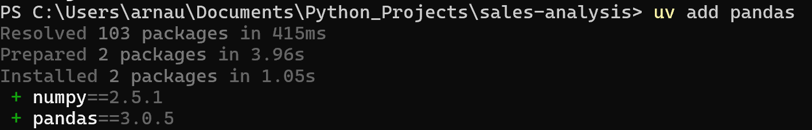

# 04 - Managing Dependencies with uv

## Goal

In this chapter, we'll learn how to manage the dependencies of a Python project using `uv`.

We'll install and remove packages, synchronize environments, and understand how `uv` keeps every developer working with the same project configuration.

## Prerequisites

Before starting this chapter, you should already have a Python project created with `uv`.

If not, Chapter 03 walks through creating a new project from scratch.

## Learning objectives

After completing this chapter, you'll be able to:

- install new Python packages
- remove packages you no longer need
- synchronize an existing environment
- understand the purpose of `pyproject.toml`
- understand the purpose of `uv.lock`

---

## Why this matters

When working on a project, the code is only one part of what makes it run.

Every project also depends on external Python packages such as `pandas`, `numpy`, or `matplotlib`.

Rather than asking every team member to install these packages manually, `uv` records the project's dependencies in configuration files. Anyone working on the project can then recreate the same environment with a single command.

This makes projects easier to share, easier to reproduce, and easier to maintain over time.

---

## Installing a package

Suppose we want to analyse sales data stored in a CSV file.

One of the most commonly used Python libraries for this type of work is `pandas`.

To add it to the project, run:

```powershell
uv add pandas
```

`uv` automatically:

- installs the package
- updates `pyproject.toml`
- updates `uv.lock`
- installs any additional packages required by `pandas`

Once the command finishes, `pandas` is immediately available inside the project's virtual environment.

You can now import it in your Python code or Jupyter notebooks.

```python
import pandas as pd
```

The following screenshot shows the output produced by `uv` after installing a package.



---

## Understanding what `uv` changes

When you add a package to a project, `uv` does much more than simply downloading it.

The following diagram summarizes what happens when running `uv add`.

```text
             uv add pandas
                   │
                   ▼
        Downloads the package
                   │
                   ▼
      Updates pyproject.toml
                   │
                   ▼
          Updates uv.lock
                   │
                   ▼
      Installs into the .venv
                   │
                   ▼
        Ready to import in code
```

This workflow is one of the main reasons why modern Python projects are easy to reproduce.

Rather than relying on the packages installed on your computer, the project itself records the dependencies it needs.

This means that anyone working on the project can recreate the same environment by reading the project's configuration files.

---

## Understanding `pyproject.toml`

The `pyproject.toml` file is the central configuration file of the project.

It contains information such as:

- the project name
- the Python version
- the project's dependencies

For example, after installing `pandas`, you might see something similar to:

```toml
[project]
name = "sales-analysis"
version = "0.1.0"
requires-python = ">=3.14"

dependencies = [
    "jupyter",
    "pandas",
]
```

Think of this file as the project's shopping list.

It describes **what** the project needs, but not exactly **which versions** were installed.

---

## Understanding `uv.lock`

While `pyproject.toml` describes the project's dependencies, `uv.lock` records the exact versions that were installed.

For example, instead of simply recording:

```text
pandas
```

the lock file records something similar to:

```text
pandas==2.3.1
numpy==2.3.2
python-dateutil==2.9.0
...
```

Most of the time, you won't edit this file manually.

Instead, `uv` updates it automatically whenever dependencies change.

Keeping this file in the repository ensures that everyone working on the project installs the same versions of the same packages.

---

## Synchronizing your environment

When you clone an existing project, the virtual environment usually isn't included in the repository.

Instead, the project contains the information needed to recreate it.

To install all the dependencies defined by the project, simply run:

```powershell
uv sync
```

The following diagram summarizes the process.

```text
Clone the repository
        │
        ▼
     uv sync
        │
        ▼
Read pyproject.toml
        │
        ▼
Read uv.lock
        │
        ▼
Create or update .venv
        │
        ▼
Project ready to use
```

Rather than installing packages one by one, `uv sync` recreates the project's environment automatically.

For most projects, this is the first command you'll run after opening the repository for the first time.

---

## Removing a package

If a dependency is no longer needed, you can remove it with:

```powershell
uv remove pandas
```

`uv` automatically:

- removes the package from the virtual environment
- updates `pyproject.toml`
- updates `uv.lock`

Keeping dependencies up to date helps keep projects easier to understand and maintain.

If you're unsure whether a package is still used, it's often worth checking the project before removing it.

---

## Summary

In this chapter, we've learned how `uv` manages the dependencies of a Python project.

Rather than installing packages directly into Python, `uv` records the project's dependencies and keeps the virtual environment synchronized with the project configuration.

Along the way, we've learned how to:

- install new packages
- remove packages that are no longer needed
- synchronize an existing environment
- understand the purpose of `pyproject.toml`
- understand the purpose of `uv.lock`

These concepts are central to modern Python development and help ensure that everyone working on the same project uses a consistent environment.

---

## After completing this chapter

You should now be able to:

- add and remove project dependencies
- recreate a project's virtual environment
- understand the difference between `pyproject.toml` and `uv.lock`
- recognize the most common `uv` commands used in day-to-day development

---

## Cheat Sheet

| Task | Command |
|------|---------|
| Add a package | `uv add <package>` |
| Remove a package | `uv remove <package>` |
| Synchronize the environment | `uv sync` |
| List installed packages | `uv tree` |
| Show the installed version of Python | `python --version` |
